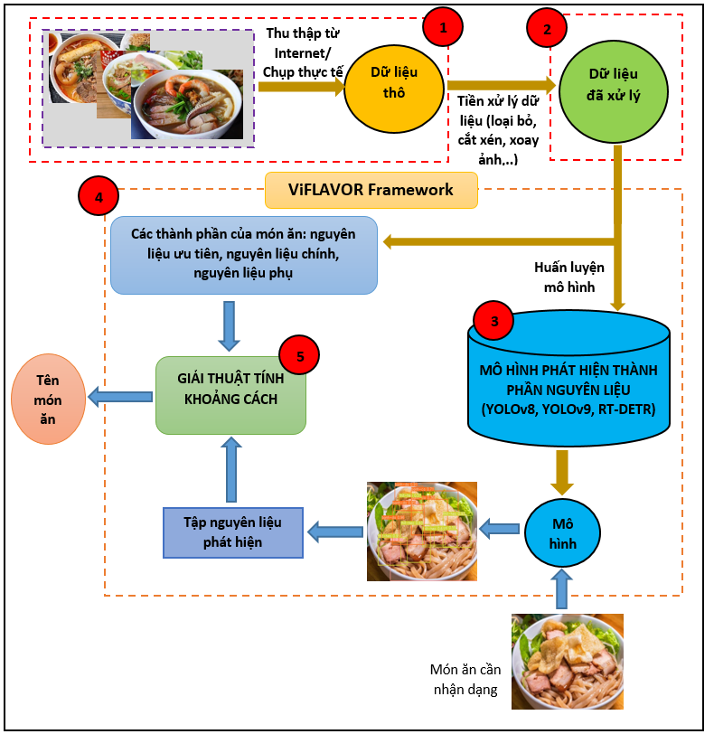
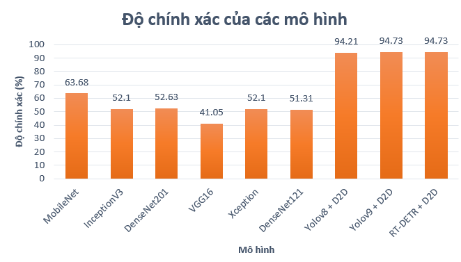

# ViFLAVOR: NHẬN DẠNG ẨM THỰC VIỆT TỪ CẤP ĐỘ ƯU TIÊN CỦA NGUYÊN LIỆU

Nhóm tác giả gồm: *Mã Trường Thành, Đổ Hiếu Nghĩa, Huỳnh Gia Khương, Đỗ Thanh Nghị*

Ẩm thực Việt là một phần không thể thiếu trong văn hóa và đời sống của người Việt Nam. Với sự phong phú, đa dạng về các thành phần nguyên liệu và hương vị đặc trưng, ẩm thực Việt Nam đã thu hút sự quan tâm, yêu thích và trở thành nguồn cảm hứng vô tận cho các đầu bếp và nhà nghiên cứu ẩm thực trên khắp thế giới. Tuy nhiên, đối với những người ngoại quốc hoặc những người không tìm hiểu nhiều về ẩm thực địa phương thì việc nhận dạng các món ăn đặc sản của Việt Nam sẽ có thể gặp khó khăn vì đặc điểm và cách chế biến của chúng thường mang những đặc trưng riêng biệt cho từng vùng miền, chẳng hạn, thành phần bún riêu cua của các miền là khác nhau. Vì vậy, một hệ thống trí tuệ nhân tạo (AI) có khả năng nhận biết món ăn đặc sản của Việt Nam thông qua việc xác định các thành phần nguyên liệu thì hoàn toàn mong đợi. Hệ thống sẽ giúp cho việc tìm hiểu và trải nghiệm ẩm thực địa phương trở nên dễ dàng hơn, đặc biệt là đối với du khách quốc tế. Nghiên cứu này sẽ tập trung phát hiện và nhận dạng các thành phần nguyên liệu trên ảnh chụp về món ăn. Từ đó, dựa trên các thành phần nguyên liệu được tìm thấy, giải thuật D2D đã đã được giới thiệu để xác định tên món ăn. Kết quả phân loại món ăn của mô hình đề xuất đạt hiệu quả mong đợi trên 94%. Cuối cùng, chúng tôi đã cài đặt một Website để triển khai ViFLAVOR và cung cấp mã nguồn trên Github.

**Kiến trúc của mô hình ViFLAVOR gồm 5 bước chính được mô tả như sau:**

1. Bước 1: **Thu thập hình ảnh và thông tin của món ăn:** thực hiện thu thập hình ảnh của 14 món ăn đặc sản Việt Nam gồm: bún cá, hủ tiếu Mỹ Tho, bún nước lèo, cơm tấm Long Xuyên, bún hải sản bề bề, bánh hỏi heo quay, cơm gà, cao lầu, mì Quảng, bún bò Huế, phở Hà Nội, bún mực, bún mọc, bún đậu mắm tôm. Ngoài ra còn thu thập thêm hình ảnh của một số món ăn khác. Nguồn ảnh được thu thập từ Google Images, kết hợp với chụp ảnh món ăn ngoài thực tế bằng nhiều thiết bị chụp ảnh khác nhau – nhằm tạo nên sự đa dạng cho tập dữ liệu.
2. Bước 2: **Tiền xử lý dữ liệu:** ảnh sau khi được thu thập sẽ có thể chứa các thành phần thừa không liên quan đến món ăn nên ViFLAVOR đã cắt ảnh để tập trung vào món ăn trong ảnh. Ngoài ra nghiên cứu còn áp dụng kỹ thuật tăng cường dữ liệu bằng cách xoay ảnh ở nhiều góc độ khác nhau để số lượng dữ liệu được đa dạng hơn. Thực hiện gán nhãn cho các thành phần nguyên liệu trên từng ảnh món ăn bằng công cụ LabelImg. Tổng số lượng nhãn là 27 nhãn ứng với 27 loại nguyên liệu từ các món ăn bao gồm: cá, bún, hủ tiếu, tôm, thịt heo, gan, thịt heo quay, thịt bò, trứng, thịt bằm, tôm tít, mực, viên mọc, bánh hỏi, dưa chua, phở, cơm, sườn, bì, thịt gà, rau răm, mì, bánh đa, chả cốm, dồi sụn, đậu hũ, chả giò.
3. Bước 3: Huấn luyện các mô hình phát hiện đối tượng: Sau khi thu thập ảnh và tiền xử lý, bước kế tiếp là huấn luyện các mô hình phát hiện đối tượng với Yolov8, Yolov9 và RT-DETR. Ở nội dung này, bài báo sẽ cung cấp, trình bày và so sánh kết quả của các mô hình bằng cách sử dụng chỉ số mAP (Mean Average Precision) để đánh giá hiệu suất của từng mô hình.
4. Bước 4: **Phát triển ứng dụng nhận dạng món ăn ViFLAVOR:** Từ mô hình đã đạt được huấn luyện, chúng tôi triển khai mô hình ViFLAVOR trên nền tảng Web sử dụng Flask và Vuejs. Quá trình này còn bao gồm việc kiểm thử mô hình và tích hợp giải pháp vào ứng dụng Web thực tế.
5. Bước 5: **Cài đặt giải thuật D2D tính khoảng cách để xác định kết quả:**  sau khi sử dụng mô hình phát hiện được tập các thành phần nguyên liệu có trong món ăn thì bước cuối cùng là xác định được tên gọi của món ăn đó. Đây là điều khó khăn vì sự phức tạp trong nguyên liệu của các món ăn và như đề cập ban đầu, mỗi vùng miền lại sử dụng các thành phần đặc trưng riêng ở địa phương của họ. Ngoài ra việc kết hợp các thành phần ăn kèm với món ăn lại khác nhau và rất đa dạng. Vì vậy, một bảng mô tả các thành phần của các món ăn (cụ thể là 14 món ăn như đề cập ở bước 1) bao gồm nguyên liệu ưu tiên, nguyên liệu chính và nguyên liệu phụ đã được cung cấp. Từ bảng thành phần này, một giải thuật tính khoảng cách (giữa các thành phần nguyên liệu phát hiện được và bảng thành phần) đã được đề xuất. Dựa trên khoảng cách tìm được để đưa ra kết luật. Cụ, thể tìm các nguyên liệu trong ảnh mà gần nhất với món ăn trong bảng thành phần. Bảng thành phần và giải thuật này sẽ được trình bày ở mục tiếp theo.

## Đánh giá độ chính xác
Bên cạnh các mô hình object detection, chúng tôi cũng thực nghiệm trên sáu mô hình học sâu bao gồm LeNet, MobileNet, InceptionV3, VGG16, ResNet101, DenseNet201. Chúng tôi đã sử dụng một tham số là batch size: 64, kích thước ảnh là: 64x64, sử dụng early-stopping với patience: 5. Kết quả độ chính xác đạt được trên các mô hình theo hai hướng tiếp cận đối với tập kiểm tra được thể hiện trong hình dưới đây.

### Video demo của hệ thống nằm ở file demo_fair.mp4 trong repository này.